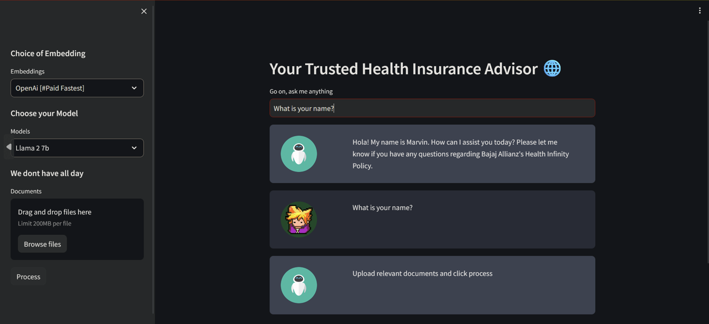

# Conversational Chatbot for PDF files 

A Conversational Chatbot built using OpenAI ChatGPT, Langchain, Python, and Huggingface
Models. This ongoing project aims to create a tool capable of querying PDF files, enhancing
information accessibility and processing.

A Majority of explanataion is given in the ipynb file itself. And did i mention all of the UI's on a web app? ( ͡° ͜ʖ ͡°)

### How to

1. **Choose your Model:** Select the preferred language model for chat interactions.
2. **Choose Embedding:** Pick an embedding method suitable for your needs.
3. **Upload your Document:** Upload the PDF file you want to query, and after a brief processing period, you can start asking questions related to the content.

### Why this?

I tested multiple embedding indexing and LLM models to create a chatbot that could potentially rival chatgpt, the closest that i got was with Meta LLAMA2 and i am using the 7b version which also performed well for my usecase

### Before you use

Ensure you have all necessary files, including HTML and CSS templates. You might need to remove any custom scripts i may have included to speed up my workflow

Running these models on local systems might be challenging due to high CPU and VRAM usage. It is recommended to use cloud-based platforms like Colab for efficient execution.

To host and use Streamlit on Colab, a local tunneling application is required. Refer to the notebook for details for the  specific application.

### Conclusion

Perhaps in the future i will create a more indepth explanataion, highlighting my process and choices
While the current documentation provides a basic overview, future updates may highlighting my process and decision-making.

### Future

*   Find a good model to abuse (The current star is LLAMA 2 7b)
*   Prompt engineer for accurate output maybe?
*   Fine tune model instead of using it directly from huggingfacehub
*   ~Create VectorDatabase and store permanently~
*   Use multiple function of LLM model (Summarization,extraction etc)
*   ~Rely on openai once~
*   Save Model permanently (Also remove constant logins) (https://medium.com/@ml_kid/how-to-save-our-model-to-google-drive-and-reuse-it-2c1028058cb2)
*   Break Chunks and process if t4 cant take it (Threading might be a possible approach to this)
*   Modify Streamlit to not disconnect as often (Create threading and ping server so it stays active)

Ranked by priority

  
If you are seeking a more capable model, considering Falcon or Llama 40b is advisable. The YouTube channel of @Nicholas_Renetton is a valuable resource for this.

#### Cheers!
