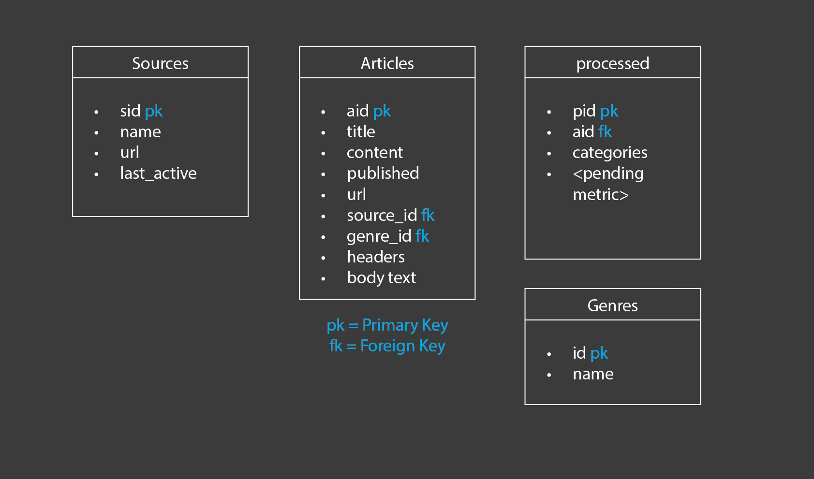
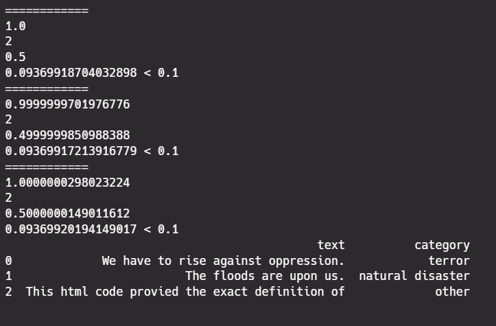

### Arrange.ipynb is the file

~Will fill additional details here in a few hours~

Overview of the file and process as i didnt have time to cleanly put comments and explain my entire decision making.

### Part 1 Scraping

- Pretty straight forward, i used feed parser to scrape all the data and the headers and body text.
- Created a failed dataframe for all data that might have failed. This is mainly because i know that we are going to scrape the body text so while we do that we can get the published date again.

### Part 2 Database 

With the data given to me i would choose somthing like this (I have chosen postgres)

The idea behind this arrangement is to reduce the load on the main articles table
- Currently i only have a sample size of ~200, but in reality this will be one of the heaviest tables to the point there will be articles_m1 articles_365 and so on
- Genre and Sources are divided to track what kind of company is releasing what kind of news over the times. Genre is also of text array type since a news can be of more than 1 genre.
- Processed is also in a different table and only references the main through id, since it might be further called for more analysis (Such as Trends rise, Tracking etc.)
- Alternatively we can have articles in a seperate table altogether and only call it rarely.

The goal here was to optimize it.

### Part 2.1 Database processing

Moving on to the programming side of the things

Before i could insert data into the database i at least wanted to ensure that the data for the columns  i need was clean.

#### Process
- So i cleaned up the body text (brackets html code etc.)
- Added a part to remove commonly used phrases like readmore click here greed etc. In the future we can make a list of these words by asking an Ai or LLM.
- The function can handle both lists and text, which is important in a mixed raw data

- For time, I had to create a function to clean it convert it and then force it into a datetime type all for smooth integration when i require to push it into postgres.
- All data was converted to UTC GMT and the datatype is a timestamptz type for future easy conversions

- Then insert to Database

### Part 3 Categorizations

- Explored a few methods, but since I was on a deadline, iI settled on using a huggingface pipeline after trying and testing a few mdoels
- Originally i was going to use spacy text classification models, but this is faster
- We can combine this with seed words technique to get a more accurate classification
- Also incorporated a small method to decide whether it really cant be classfied anywhere else (beneath a treshold) then it would go to "Others"

This shows the program trying to compare different scores, to the threshold i gave and classifying a sample data.

### Part 4 Celery

Finally coming to Celery. I used it since it was recommended in the objective, granted it was not the smartest move. \

I created a small script to see whether celery was able to interact with postgres and my code. Along with some logging to continously debug the process.

PS : Celery has been upgraded while keeping in mind about flask and django and the like. So not all versions of celery and its dependencies work now. And its dependencies like kombu,redis have all been created for linux and not specifically for windows.

### Part 5 Main

Here i am creating multiple asynchronous tasks of categorization so they work parallely and can run the resource heavy function. Once we are done extracting data from postgres

#### Explanation

- Break dataframe into chunks
- Run pipeline for each chunk (Divided between celery workers)
- Append all parts
- Success

This bit is still in progress as i had a lot of trouble integrating everything into this. Not only is it tricky to handle dataframes across a json messaging service, celery is performing fairly awkwardly in windows. While i was able to divide the task among workers i wasnt able to integrate all the results to create the final dataframe and write that into a file within the timelimit. however since all individual components are working i am positive its not Impossible.

##### Thank you

